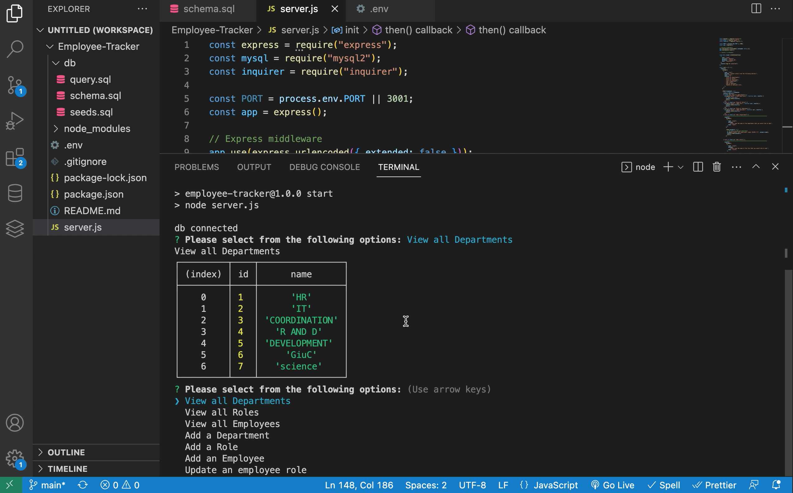
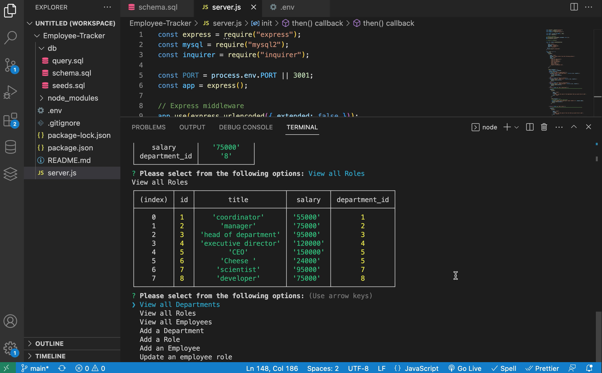
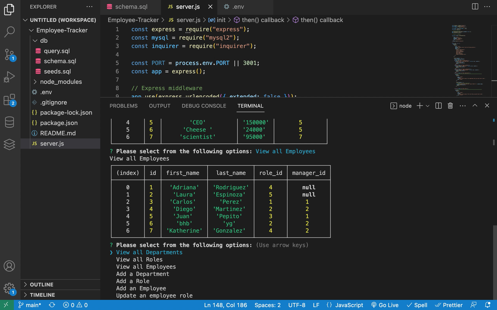

# Employee Tracker 

## Description

In this unit we were introduced to CMS (Content Management Systems) and were tasked to create a way for company's to create and view their list of departments, the different roles within the departments, the employees, their managers, and how to update that information if necessary using the command line and also while working with node, inquirer, and MYSQL. 

The reason why I made this Logo Generator was because as a Full-Stack Developer, I need to learn as many skills as I can and this homework assignment allowed me to work with node, inquirer, and MYSQL simultaneously which poses many different challenges and lessons along the way.

## Table of Contents

* [Usage](#usage)
* [Acceptance Criteria](#criteria)
* [Screenshot](#screenshot)
* [Walkthrough Video](#video)

## User Story

AS A business owner
I WANT to be able to view and manage the departments, roles, and employees in my company
SO THAT I can organize and plan my business

## Acceptance Criteria

GIVEN a command-line application that accepts user input
WHEN I start the application
THEN I am presented with the following options: view all departments, view all roles, view all employees, add a department, add a role, add an employee, and update an employee role
WHEN I choose to view all departments
THEN I am presented with a formatted table showing department names and department ids
WHEN I choose to view all roles
THEN I am presented with the job title, role id, the department that role belongs to, and the salary for that role
WHEN I choose to view all employees
THEN I am presented with a formatted table showing employee data, including employee ids, first names, last names, job titles, departments, salaries, and managers that the employees report to
WHEN I choose to add a department
THEN I am prompted to enter the name of the department and that department is added to the database
WHEN I choose to add a role
THEN I am prompted to enter the name, salary, and department for the role and that role is added to the database
WHEN I choose to add an employee
THEN I am prompted to enter the employee’s first name, last name, role, and manager, and that employee is added to the database
WHEN I choose to update an employee role
THEN I am prompted to select an employee to update and their new role and this information is updated in the database

## Usage

Users can use this program by opening this file in their VS and using the server.js file to open up their terminal. Once the terminal has been opened, they will type "npm i -y" in their terminal and once that's complete they will type node server which will render the prompts. The user will go through with answering every question that is prompted to them including adding departments, roles, employees, or updating the roles of any current employees. 

In the future I would like to be able to add more prompts such as updating employees, departments, salaries etc

## Screenshot

## Walkthrough Video
Link to Video Demo: https://drive.google.com/file/d/1ZDLuhvi3tkRWDEAorDicM-stNLKjh6iz/view?usp=share_link

## Links
Repo: https://github.com/tatys5394/employee-tracker.git

